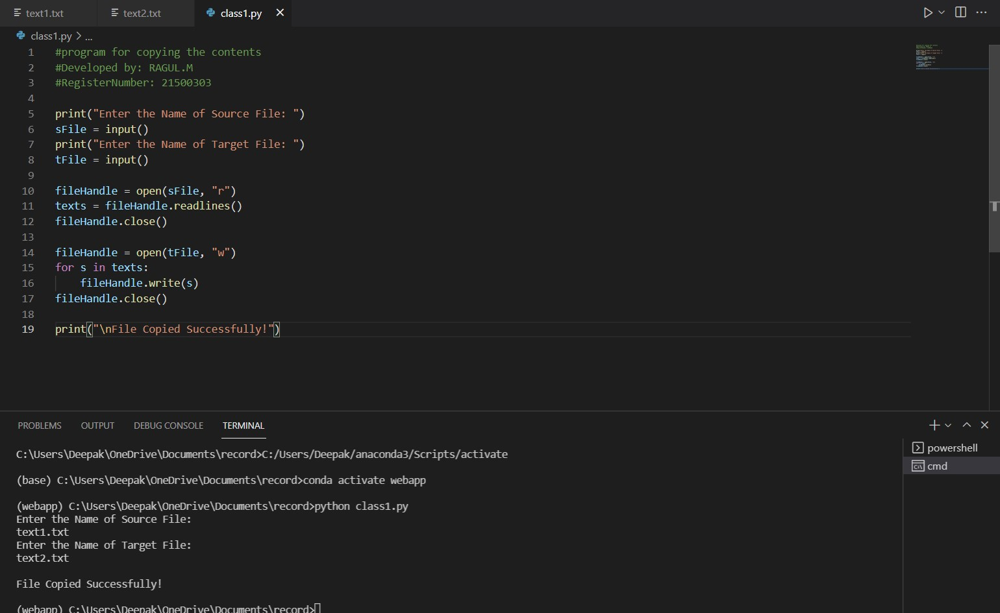
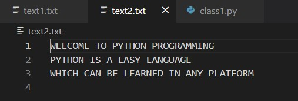

# copy-file
## AIM:
To write a python program for copying the contents from one file to another file.
## EQUIPEMENT'S REQUIRED: 
PC
Anaconda - Python 3.7
## ALGORITHM: 
### Step 1:
Create a .py extension in folder.
### Step 2: 
Create two .txt files, one for source and another for target. 
### Step 3: 
Now input the code.
### Step 4:  
Run the code in the terminal using correct path.
### Step 5: 
Enter the source file and target file name when its is asking in the output.
### Step 6: 
Now the texts in sources files are copied to the target file, Now end the program
## PROGRAM:
~~~
#program for copying the contents
#Developed by:Ragul M
#RegisterNumber: 21500303

print("Enter the Name of Source File: ")
sFile = input()
print("Enter the Name of Target File: ")
tFile = input()

fileHandle = open(sFile, "r")
texts = fileHandle.readlines()
fileHandle.close()

fileHandle = open(tFile, "w")
for s in texts:
    fileHandle.write(s)
fileHandle.close()

print("\nFile Copied Successfully!")
~~~
### OUTPUT:

## RESULT:
Thus the program is written to copy the contents from one file to another file.